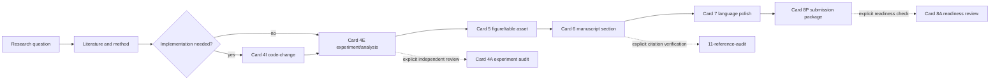

# 01 Product-First Paper Workflow

目标：把研究问题推进为论文、代码、实验、图表和投稿文件。验证与记录服务于主产物，不构成独立的默认阶段。

## Main flow

Solid arrows are normal product dependencies. Dashed arrows are explicit checks,
not automatic stages.

## Product stages

| Stage | Primary route | Primary product | Supporting records |
|---|---|---|---|
| Project definition | `01-project-brief` | research question, scope and constraints | `paper.yaml`, logs when decisions change |
| Idea/formalization | Cards 1A/1B/1C | candidate mechanisms and author decision | idea workspace |
| Literature | Card 3 | reading map or target review section | references and reading matrix |
| Method design | Card 2M | method specification | decision/open-question notes |
| Code implementation | Card 4I | executable source and tests | MODULE_MAP only when interfaces change |
| Experiment | Card 4E | actual results, metrics and outputs | run/evidence records |
| Figure/table | Card 5 | visual asset, caption or bounded design | manifest |
| Manuscript | Card 6 | target section | paragraph map |
| Language | Card 7 | revised active-source text | none by default |
| TeX transition | `09-tex-freeze-formalize` | compilable TeX | freeze state/log |
| Submission | Card 8P | uploadable files | checklist/declarations |
| Revision | `13-reviewer-response` | revised manuscript and response letter | response matrix/change log |

## Optional checks

Use only when explicitly requested or when the product milestone clearly requires
it:

- `07-experiment-audit`: independent experimental validity review;
- `11-reference-audit`: citation/source verification;
- Card 8A: final submission readiness inspection;
- `14-agent-safety`: operation-specific middleware for external or consequential actions.

An optional check must not become a permanent bridge between every pair of
product stages.

## Execution rules

1. Select one highest-impact unresolved product defect.
2. Modify that product directly.
3. Run the smallest relevant validation.
4. Repair once when local and in scope.
5. Update supporting records once when the product change makes them stale.
6. Report the direct result in domain-native language.

## Stop conditions

Stop rather than creating process artifacts when:

- the product target is undefined;
- required source, data, credentials or author action is unavailable;
- the requested conclusion cannot be supported honestly;
- the requested operation is unsafe or unauthorized.

State the smallest next action and stop. Do not create blocker packages, repeated
handoffs or simulated reviews.