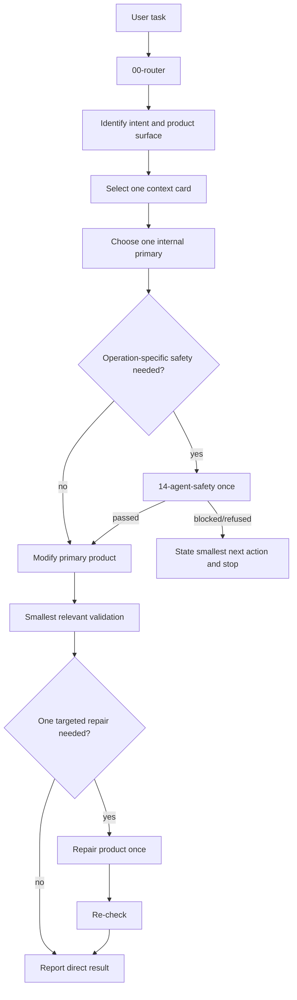

# 02 Route-and-Execute Workflow

Use this only when the selected card still has a concrete ownership ambiguity.
It supplements `.agent/context_cards.md`; it does not replace the cards.

## Default flow



Routing, safety, validation and support-record maintenance are internal. They do
not determine the language of the product or the normal final response.

## Product selection rules

| User verb | Primary route |
|---|---|
| write/rewrite/revise/polish | manuscript or response artifact |
| implement/fix/refactor/optimize | code and relevant tests |
| run/evaluate/compare | experiment or analysis result |
| draw/generate/revise figure | actual visual asset |
| prepare submission | uploadable submission files |
| audit/verify compliance/independent review | explicit audit findings |

Generic “review” means improve the named product unless the user clearly asks for
an independent check.

## Ambiguity rules

| Condition | Action |
|---|---|
| selected card fits | dispatch immediately |
| one concrete dependency is missing | add exactly that input |
| more than one supporting skill seems necessary | split into product slices |
| green operation | proceed |
| amber already authorized | pass once and resume primary |
| amber not authorized | state smallest next action and stop |
| red operation | refuse |
| audit not explicit | do not select an audit primary |

## Internal completion trace

```yaml
intent: create | modify | implement | execute | explain | verify | audit
primary_surface: manuscript | code | experiment | figure | submission | decision | governance
primary_output_paths: []
supporting_record_paths: []
validation: pass | fail | not_run
visible_to_user: false
```

Normal user response:

```text
Changed
Result
Validation
Remaining issue, if material
```

## Anti-patterns

- Loading all skills or workflows.
- Calling `00-router` again inside the same unchanged task.
- Treating a safety pass as a final result.
- Selecting audit because it is easier to verify than implementation.
- Accepting a manifest, ledger, report or validation-only change as product completion.
- Repeating validation without an intervening product change.
- Putting route state, IDs, gates or blocker schemas into the product language.