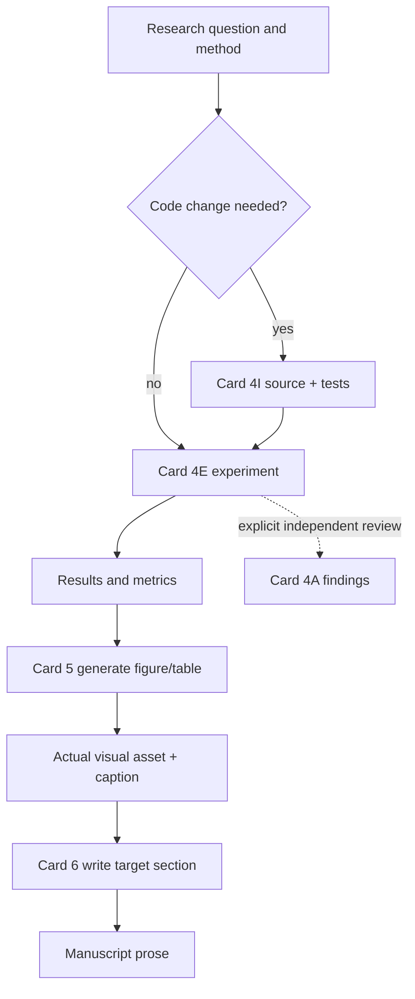

# 04 Experiment Figure Manuscript Workflow

目标：把研究问题转化为实验结果、图表和正文。矩阵、台账和 manifest 负责保持一致性，但不替代实际结果、图和段落。

## Flow

## Product versus supporting records

| Task | Primary product | Supporting records |
|---|---|---|
| implement experiment code | source and tests | method/module notes when changed |
| execute experiment | results, metrics, model/plot outputs | run ledger, evidence matrix |
| generate result figure | figure file, source and caption | figure manifest |
| write result section | manuscript prose | paragraph map |
| independently review experiment | concrete findings/rerun specification | audit notes |

A supporting-record-only change does not complete the corresponding product task.

## Result-to-prose translation

Internal states are translated into normal academic language:

| Internal state | Product-facing expression |
|---|---|
| `missing` | no conclusion yet; omit or retain a TODO |
| `planned` | describe the planned protocol, not a finding |
| `to_verify` | preliminary analysis suggests; confirmation is required |
| `partially_supported` | results suggest or provide partial support |
| `supported` | results support the conclusion within the stated setting |
| `refuted` | results do not support or contradict the hypothesis |
| `blocked` | the question could not be evaluated because of the named limitation |

Do not copy matrix labels, run IDs, file paths or status vocabulary into the
manuscript.

## Recommended product slices

| User task | Route | Completion condition |
|---|---|---|
| implement baseline | Card 4I | executable baseline and targeted tests pass |
| run comparison | Card 4E | actual metrics/results exist |
| generate F1 | Card 5 `figure_generate` | figure asset and caption exist |
| write Results paragraph | Card 6 | target prose is updated |
| independently verify validity | Card 4A | explicit findings are returned |

## Validation

Use only checks that test the changed product:

- code: targeted unit/smoke test;
- experiment: result parser and predefined comparison;
- figure: source consistency, readability and export;
- manuscript: source/result consistency and compile when relevant.

Do not run repeated repository-wide checks between every product step.

## Stop conditions

- the primary product cannot be identified;
- experiment inputs or authorization are unavailable;
- no result distinguishes the hypotheses;
- a figure lacks actual source data;
- prose would require an unsupported conclusion.

State the smallest resolving action and stop without generating extra process
artifacts.