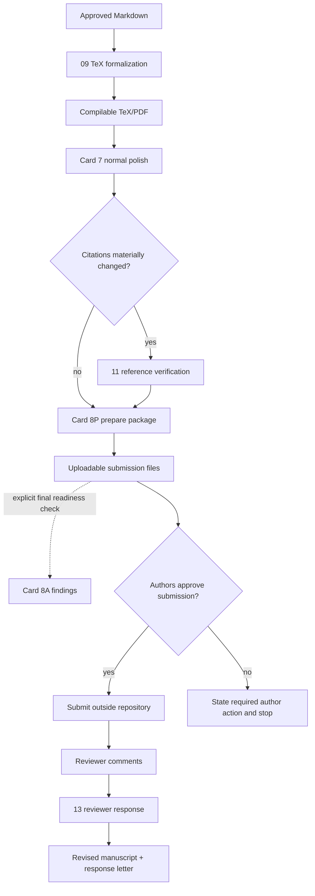

# 05 TeX Submission and Revision Workflow

目标：形成可编译正式稿、可上传投稿包和专业回复信。检查服务于这些文件，不成为独立的默认产品。

## Flow



## Product stages

| Stage | Primary product | Supporting records |
|---|---|---|
| TeX formalization | compilable TeX/PDF | freeze state and log |
| Normal polish | revised active-source text | none by default |
| Citation verification | corrected citations/BibTeX and concrete findings | reading matrix when needed |
| Package preparation | PDF, TeX, BibTeX, figures, declarations, cover letter, highlights | submission checklist |
| Readiness check | explicit final findings and corrections | checklist status |
| Reviewer response | revised manuscript and response letter | response matrix and change log |

## Mode distinction

### Card 8P — prepare package

Use when the user asks to prepare, assemble, export or update submission files.
Completion requires actual uploadable files. A checklist or blocker list alone is
not completion.

### Card 8A — readiness check

Use only for an explicit final inspection. Report concrete issues and fixes; do
not automatically enter this mode after every package edit.

## Reviewer-response rule

Stable comment IDs and response matrices are internal support. The product-facing
response letter uses normal editorial language:

```text
direct answer
what changed in the manuscript
result or source supporting the response
precise manuscript location
```

Do not expose coverage-state labels, route IDs or internal record terminology in
the submitted response letter.

## External actions

Actual submission, Git remote writes and external uploads require explicit user
authorization. When author information, declarations, credentials or approval is
missing, state the smallest required action and stop. Do not build an additional
blocker package around the missing action.

## Validation

- TeX/PDF: compile and inspect the changed source;
- references: resolve changed citations;
- package: verify required files and official venue constraints;
- response: compile the letter and check every comment has a substantive answer.

Run one final repository-level validation after the product slice is complete,
not between every edit.

## Stop conditions

- active source or target template is ambiguous;
- required author/compliance information is unavailable;
- source cannot compile because an external template/resource is missing;
- a reviewer request requires an unsupported scientific conclusion;
- submission or upload lacks explicit authorization.