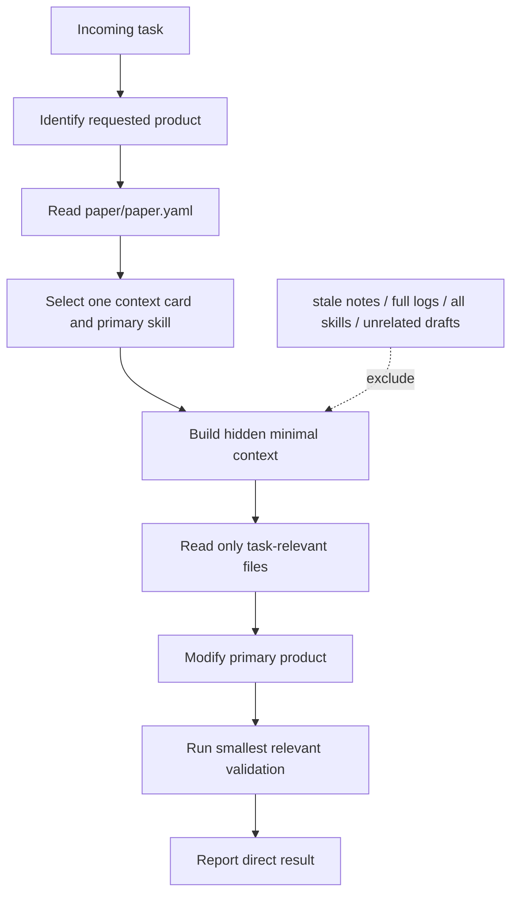

# 08 Context Hygiene Workflow

目标：让 Agent 只读取完成主产物所需的最小上下文。context packet 是内部调度信息，不是用户可见产物，也不应进入论文、代码注释或普通汇报。

## Flow



## When to use

Use when:

- the request is broad and the primary product is not yet fixed;
- multiple skills appear relevant;
- previous conversation, logs, or old drafts may pollute the task;
- the agent is about to scan the whole repository;
- a product task risks being replaced by record maintenance or review work.

## Hidden context packet

The router may maintain internally:

```yaml
context_packet:
  task: <one direct product action>
  intent: create | modify | implement | execute | explain | verify | audit
  primary_surface: manuscript | code | experiment | figure | submission | decision | governance
  language_register: academic | engineering | operational | editorial | governance
  paper_state: {paper_stage: <...>, active_source: <...>, frozen: <...>}
  primary_skill: <one skill path>
  supporting_skill: <one skill path or none>
  primary_output_paths: []
  supporting_record_paths: []
  files_to_read: []
  files_to_write: []
  excluded_context: []
```

This packet is hidden by default. Do not print it as a preamble or completion
report unless the user explicitly asks to debug routing.

## Default read sets

| Product task | Read first | Exclude first |
|---|---|---|
| Research decision | project state, selected idea/method, one relevant source/result | all logs and all priors |
| Literature map | reading matrix, BibTeX, bounded question | full manuscript unless needed |
| Review-section revision | target section, reading matrix, needed sources | unrelated sections |
| Code implementation | target source, config, nearest test, method spec if needed | whole repository and MODULE_MAP-only detours |
| Code comprehension | target subsystem, config/test, MODULE_MAP | unrelated implementation |
| Experiment execution | method, target code/config, data/parser, run record | audit files and unrelated code |
| Figure generation | target data/result, figure brief, current asset/manifest | unrelated figures and decorative references |
| Manuscript drafting | target section, paragraph roles, one relevant source/result input | all draft sections |
| Submission package | TeX/PDF, required files, official venue requirements | old Markdown formal edits |
| Explicit audit | exact product and concern being reviewed | unrelated governance history |

## Clean execution pattern

1. Identify the requested product and language register.
2. Read only the files needed for that product.
3. Modify the product before optional support records.
4. Run the smallest check that tests the product change.
5. Update supporting records once when stale.
6. Report the result without internal context metadata.

## Language firewall

Internal file names, IDs, approval state, matrix/ledger/manifest state, hashes,
routing and stop-state vocabulary remain internal. Manuscripts, captions,
production-code comments, experiment summaries and normal replies use natural
domain language.

## Stop conditions

Stop when:

- the primary product cannot be identified;
- more than four unrelated files would be required for one action;
- active Markdown/TeX source is ambiguous;
- an external data, credential, author, or reviewer action is required;
- the agent is about to replace product work with another context, status, or
  blocker document.

For an external dependency, state the missing action, affected product, and
smallest next human action in no more than three lines, then stop.