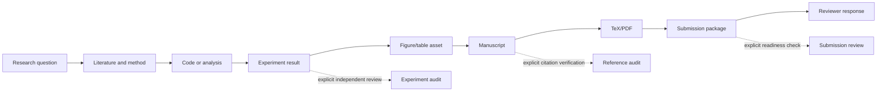

# Workflow Atlas

Workflows are supplemental references for coordinating adjacent product actions.
The default execution entry is `.agent/context_cards.md`; workflows are not a
mandatory ceremony or fallback audit path.

## Default execution path

```text
user outcome
-> paper/paper.yaml
-> one context card
-> one internal primary
-> primary product change
-> smallest relevant validation
```

A workflow may explain dependencies, but it does not replace the primary product
with a plan, checklist, ledger, manifest, status report or review package.

## Workflow index

| Workflow | Consult when | Product focus |
|---|---|---|
| 01 Product-First Paper Workflow | splitting end-to-end work | question -> code/experiment -> figure -> manuscript -> package |
| 02 Route-and-Execute Workflow | one concrete ownership ambiguity remains | direct primary-output selection |
| 03 New Project Fast Start Workflow | initializing a new paper | research question and project state |
| 04 Experiment Figure Manuscript Workflow | coordinating code, runs, visuals and prose | actual results, assets and section text |
| 05 TeX Submission and Revision Workflow | formalization, packaging or response | TeX/PDF, uploadable files and response letter |
| 06 Capability Skill Workflow | a pure tool/capability task is ambiguous | product assigned by the selected card |
| 07 File Workflow Map | file ownership is unclear | primary products versus supporting records |
| 08 Context Hygiene Workflow | context is becoming broad or stale | bounded reads and hidden internal trace |

## Lifecycle map



Solid arrows are product dependencies. Dashed arrows are explicit checks and are
not automatically inserted after every product step.

## Language boundary

Workflows may use internal file names and state internally. Manuscripts, captions,
source-code comments, experiment summaries and normal user responses use the
language of their scientific or engineering domain. Do not copy workflow terms,
route state, gate labels, ledgers, manifests, hashes or blocker schemas into the
product.

## Boundaries

- Read at most one workflow for a concrete ambiguity.
- Do not use workflows as scientific sources or authorization.
- Do not add an audit because it is easier to complete than the requested product.
- Do not repeat validation or record maintenance without an intervening product change.
- When an external action is required, state the smallest next action and stop.